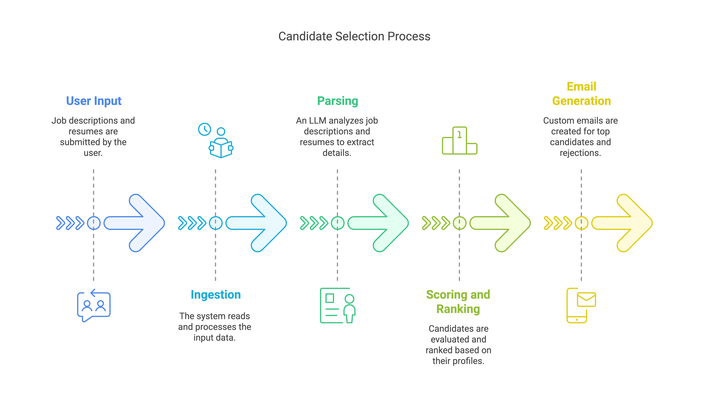

# Resume Screening Application

This application helps recruiters screen and rank resumes based on job descriptions using AI.





### How It Works


**User Input**

- Job Description: Enter text or provide a URL.
- Resumes: Upload PDF/Word files.

**Ingestion**

- Inputs are read and processed.
- Job description URLs are scraped for content.

**Parsing**

- The job description is analyzed by an LLM (GPT-4) to extract essential details.
- Resumes are processed to extract candidate profiles.

**Scoring and Ranking**

- Candidates are scored on relevance, experience, and skills.
- An average score is computed, and candidates are sorted in descending order.


**Email Generation**

- Custom email is generated based on if you want to accept or reject the candidate


## Setup Instructions

### Frontend Setup

```bash
# Install dependencies
npm install

# Start development server
npm run dev
```

The frontend will be available at http://localhost:3000

### Backend Setup

```bash
# Create and activate virtual environment
cd backend
python -m venv venv
source venv/bin/activate  # On Windows: venv\Scripts\activate

# Install dependencies
pip install -r requirements.txt

# Start the backend server
python -m uvicorn main:app --reload
```

The backend API will be available at http://localhost:8000

## Environment Variables

Create a `.env` file in the `backend` directory with the following keys:

```
OPENAI_API_KEY=your_openai_api_key_here
FIRECRAWL_API_KEY=your_firecrawl_api_key_here
```

## Features

- Upload multiple resumes (PDF)
- Enter or paste job descriptions
- Automatic parsing of resumes and job descriptions
- AI-powered candidate ranking
- Generate personalized email templates for candidates

## Technologies

- **Frontend**: Next.js, React, TypeScript, Tailwind CSS
- **Backend**: Python, FastAPI, OpenAI API
- **Tools**: PDF parsing, AI text analysis


